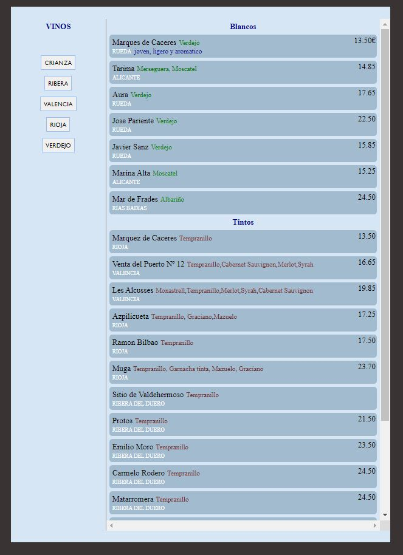
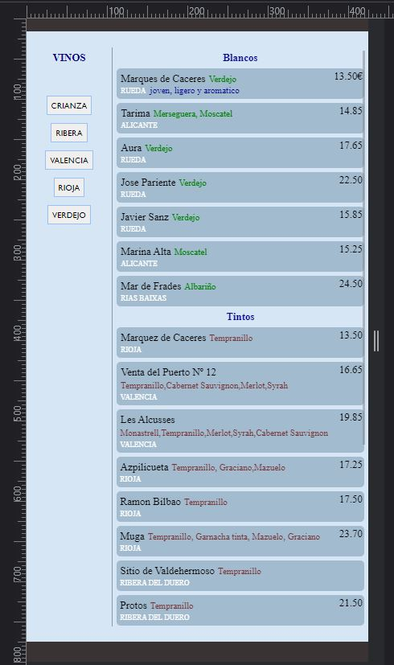

# Wine List UI

A simple page design that it is a base for a series of wine list implementations using HTML, CSS, JavaScript trying to improve skills in these technologies. At the end of series hopefully it will end as a well designed SPA
## Installation
- Use the code tab to download the zip file. 

## Usage

- Unzip the folder and run the file wines.html using Live Server or similar. VScode has Live Server extension by default.

## Screnshot

